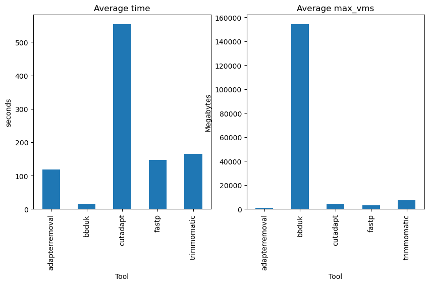
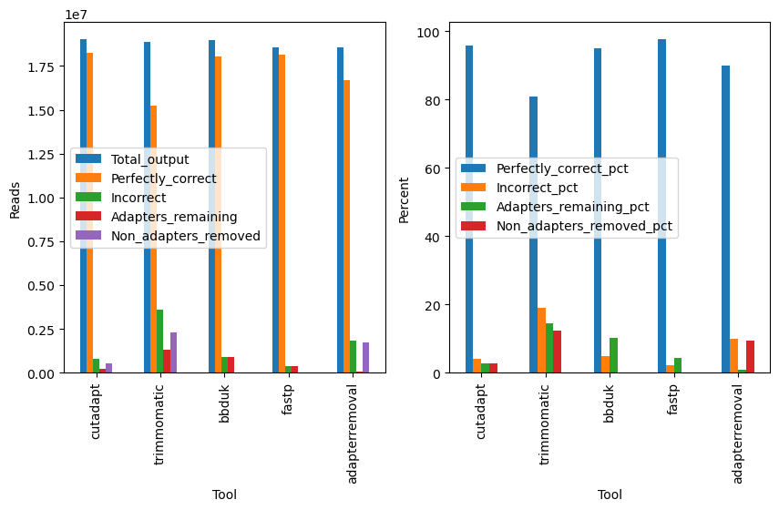

# Benchmarking adapter and quality trimming tools
Original implementation by Brian Bushnell (2014): 
http://seqanswers.com/forums/showthread.php?t=42776

The following tools are compared:

 - [AdapterRemoval](https://adapterremoval.readthedocs.io/en/stable/)
 - [BBduk](https://jgi.doe.gov/data-and-tools/software-tools/bbtools/bb-tools-user-guide/bbduk-guide/)
 - [Cutadapt](https://cutadapt.readthedocs.io/en/stable/)
 - [Fastp](https://github.com/OpenGene/fastp)
 - [Trimmomatic](http://www.usadellab.org/cms/?page=trimmomatic)

## Fake adapters, "gruseq"
The comparison adds fake truseq adapters, "gruseq", provided by Brian Bushnell,
downloaded from:
http://seqanswers.com/forums/attachment.php?attachmentid=2993&d=1398383571

## Test data
A single sample is downloaded from SRA. Feel free to replace it with whatever
you want. 

## Results
These plots are produced by the workflow, one for benchmarking results
(Snakemake runs each tool three times to assess runtime, CPU and RAM usage),
and one plot with adapter removal performance.






# Running
Run the benchmarking workflow with something like:
```bash
snakemake --use-conda --jobs 10
```

